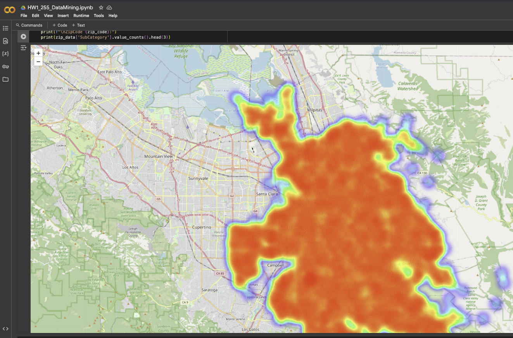

# Illegal Dumping Data Mining Project


## Project Overview

This project analyzes illegal dumping incidents data from 2015-2021 to identify patterns, trends, and insights that can help address this environmental issue. The analysis includes data cleaning, exploratory data analysis, visualization, and predictive modeling.

## Dataset

The dataset contains records of illegal dumping incidents with the following key information:
- Date and time of incidents
- Location details (address, cross street, zip code)
- Geographic coordinates (latitude, longitude)
- Categories and subcategories of dumped materials
- Status of cleanup efforts


## Data Cleaning Process

The raw data required significant cleaning to address issues such as:
- Missing values in location data
- Inconsistent zip code formats
- Standardizing subcategories
- Handling missing comments


## Exploratory Data Analysis

### Temporal Analysis

The analysis explores how illegal dumping incidents vary over time:
- Yearly trends
- Monthly patterns
- Day of week distribution
- Time of day patterns


### Spatial Analysis

Geographic distribution of incidents:
- Hotspot identification
- Zip code analysis
- Neighborhood patterns



### Material Analysis

Breakdown of dumped materials by category:
- Most common types of dumped materials
- Trends in material categories over time


## Key Insights


1. **Temporal Patterns**: Identified peak dumping periods during specific months and days of the week
2. **Geographic Hotspots**: Mapped high-concentration areas for targeted intervention
3. **Material Trends**: Analyzed most common types of illegally dumped materials
4. **Response Time Analysis**: Evaluated efficiency of cleanup response

## Visualizations

The project includes various visualizations to help understand the data:

### Heatmaps


### Time Series


### Geographic Maps


### Distribution Charts


## Tools and Technologies

- **Python**: Primary programming language
- **Libraries**:
  - Pandas: Data manipulation and analysis
  - NumPy: Numerical computing
  - Matplotlib & Seaborn: Data visualization
  - Scikit-learn: Machine learning algorithms

## Files in this Repository

- `HW1_255_DataMining.ipynb`: Jupyter notebook containing all analysis code
- `cleaned_illegal_dumping.csv`: Cleaned dataset
- `dumping_sample_10k.csv`: Sample dataset with 10,000 records
- `Images/`: Directory containing visualization outputs
- `255_HW.pdf`: Project documentation

## How to Run

1. Clone this repository
2. Install required dependencies:
   ```
   pip install pandas numpy matplotlib seaborn scikit-learn
   ```
3. Open the Jupyter notebook:
   ```
   jupyter notebook HW1_255_DataMining.ipynb
   ```

## Future Work

- Develop predictive models to forecast future dumping incidents
- Integrate additional data sources (demographic, economic indicators)
- Create interactive dashboards for real-time monitoring
- Recommend targeted intervention strategies based on findings


## Contact

For questions or collaboration opportunities, please contact [Your Name] at [your.email@example.com].

---

*This project was completed as part of the Data Mining course (CMPE 255).*
